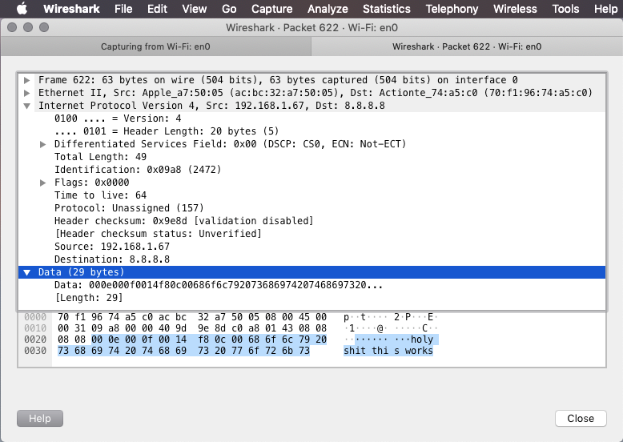

# rdtp - Reliable Datagram Transfer Protocol (0x9D)

[](https://goreportcard.com/report/github.com/adrianosela/rdtp)
[](https://godoc.org/github.com/adrianosela/rdtp)
[](https://github.com/adrianosela/rdtp/blob/master/LICENSE)

Specification and implementation of a reliable transport layer protocol to be used over IP networks.

## To-Dos:
* Reliability
  * Sequence numbers in header
  * Ack numbers in header
  * Implement cumulative acknowledgements
* Flow Control
  * Receiver window in header

## Based on:
* UDP - User Datagram Protocol [[RFC]](https://tools.ietf.org/html/rfc768)
* TCP - Transmission Control Protocol [[RFC]](https://tools.ietf.org/html/rfc793)

## Header Format

```
 0      7 8     15 16    23 24    31
+--------+--------+--------+--------+
|     Src. Port   |    Dst. Port    |
+--------+--------+--------+--------+
|      Length     |    Checksum     |
+--------+--------+--------+--------+
|          Sequence Number          | // TODO
+--------+-----------------+--------+
|       Acknowledgement Number      | // TODO
+--------+-----------------+--------+
|             ( Data )              |
+               ....                +
```

## Important Notes: 

The value for the underlying IP header's "Protocol" field must be set to 0x9D (157 -- currently [Unassigned](https://en.wikipedia.org/wiki/List_of_IP_protocol_numbers))

## Over the Wire

Here's a [Wireshark](https://www.wireshark.org/) capture of an RDTP packet over the wire:



(The highlighted bytes are the RDTP header + payload)
